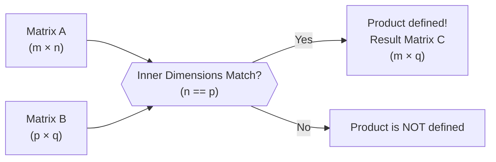

# Chapter 3: Matrices

## 1. Exhaustive Theory & Precise ISC Terminology

### 1.1 Definition and Order
A **Matrix** is an ordered rectangular array of numbers or functions. The numbers or functions are called the **elements** or **entries** of the matrix. 
A matrix having $m$ rows and $n$ columns is called a matrix of **order** $m \times n$ (read as $m$ by $n$).
*   An element appearing in the $i^{th}$ row and $j^{th}$ column is denoted by $a_{ij}$.
*   A matrix is usually denoted by capital letters (e.g., $A, B, C$).
*   $A = [a_{ij}]_{m \times n}$, where $1 \le i \le m$, $1 \le j \le n$ and $i, j \in \mathbb{N}$.

### 1.2 Types of Matrices
1.  **Column Matrix**: A matrix with only one column. Order: $m \times 1$.
2.  **Row Matrix**: A matrix with only one row. Order: $1 \times n$.
3.  **Square Matrix**: A matrix in which the number of rows is equal to the number of columns ($m=n$). Denoted as a square matrix of order $n$.
4.  **Diagonal Matrix**: A square matrix in which all its **non-diagonal elements are zero**. i.e., $a_{ij} = 0$ for $i \ne j$.
5.  **Scalar Matrix**: A diagonal matrix in which all **diagonal elements are equal**. i.e., $a_{ij} = 0$ for $i \ne j$ and $a_{ii} = k$ (where $k$ is a constant).
6.  **Identity Matrix (Unit Matrix)**: A scalar matrix in which every diagonal element is $1$. Denoted by $I$ or $I_n$. $a_{ij} = 1$ if $i = j$ and $a_{ij} = 0$ if $i \ne j$.
7.  **Zero Matrix (Null Matrix)**: A matrix in which all elements are zero. Denoted by $O$.

### 1.3 Equality of Matrices
Two matrices $A = [a_{ij}]$ and $B = [b_{ij}]$ are said to be **equal** if:
1.  They are of the **same order**.
2.  Each **corresponding element** of $A$ is equal to the corresponding element of $B$, i.e., $a_{ij} = b_{ij}$ for all $i, j$.

### 1.4 Algebra of Matrices
*   **Addition**: If $A$ and $B$ are of the same order, $A+B = [a_{ij} + b_{ij}]$.
*   **Scalar Multiplication**: If $A = [a_{ij}]$ and $k$ is a scalar, $kA = [ka_{ij}]$. Every element is multiplied by $k$.
*   **Negative of a Matrix**: $-A = (-1)A$.
*   **Difference**: $A - B = A + (-B)$.
*   **Multiplication of Matrices**: Let $A$ be $m \times n$ and $B$ be $n \times p$. The product $AB$ is a matrix $C$ of order $m \times p$ such that $c_{ij} = \sum_{k=1}^{n} a_{ik}b_{kj}$. Note: **Number of columns in A must equal number of rows in B**.

### 1.5 Transpose of a Matrix
The matrix obtained by interchanging the rows and columns of $A$ is called the **transpose** of $A$, denoted by $A'$ or $A^T$.
If $A = [a_{ij}]_{m \times n}$, then $A' = [a_{ji}]_{n \times m}$.

### 1.6 Symmetric and Skew-Symmetric Matrices
*   **Symmetric Matrix**: A square matrix $A$ is symmetric if $A' = A$ (i.e., $a_{ji} = a_{ij}$ for all $i, j$).
*   **Skew-Symmetric Matrix**: A square matrix $A$ is skew-symmetric if $A' = -A$ (i.e., $a_{ji} = -a_{ij}$ for all $i, j$). 
    *   *ISC Crucial Note*: In a skew-symmetric matrix, all diagonal elements are zero because $a_{ii} = -a_{ii} \implies 2a_{ii} = 0 \implies a_{ii} = 0$.

### 1.7 Elementary Operations (Transformations)
There are six elementary operations (3 for rows, 3 for columns):
1.  Interchanging any two rows (or columns): $R_i \leftrightarrow R_j$.
2.  Multiplying all elements of a row (or column) by a non-zero scalar $k$: $R_i \to kR_i$.
3.  Adding to the elements of a row (or column), the corresponding elements of another row (or column) multiplied by any non-zero scalar $k$: $R_i \to R_i + kR_j$.

### 1.8 Invertible Matrices
If $A$ is a square matrix of order $m$, and if there exists another square matrix $B$ of the same order $m$ such that $AB = BA = I$, then $B$ is called the **inverse matrix** of $A$ and is denoted by $A^{-1}$. In that case $A$ is said to be invertible.

## 2. Step-by-Step Derivations & Mechanisms

### 2.1 Properties of Matrix Multiplication
*   **Non-Commutative**: In general, $AB \ne BA$. Even if $AB$ and $BA$ are both defined, they are rarely equal.
*   **Associative Law**: For any three matrices $A, B$, and $C$, $(AB)C = A(BC)$, provided the multiplications are defined.
*   **Distributive Law**: $A(B+C) = AB + AC$ and $(A+B)C = AC + BC$.
*   **Existence of Multiplicative Identity**: For every square matrix $A$, there exists an identity matrix $I$ of same order such that $IA = AI = A$.

### 2.2 Properties of Transpose of a Matrix
1.  $(A')' = A$
2.  $(kA)' = kA'$ (where $k$ is a scalar)
3.  $(A+B)' = A' + B'$
4.  **Reversal Law for Transpose**: $(AB)' = B'A'$
    *   *Proof Mechanism*: Consider the $(i,j)$th element of $(AB)'$. This is the $(j,i)$th element of $AB$, which is $\sum_{k} a_{jk}b_{ki}$. 
    *   The $(i,j)$th element of $B'A'$ is the product of the $i$th row of $B'$ and $j$th column of $A'$, which translates to the $i$th column of $B$ and $j$th row of $A$, resulting in the exact same summation. 

### 2.3 Expressing a Square Matrix as Sum of Symmetric & Skew-Symmetric Matrices
**Theorem**: Any square matrix $A$ can be uniquely expressed as the sum of a symmetric and a skew-symmetric matrix.
**Derivation**:
1.  Let $A$ be a square matrix. We can write $A = \frac{1}{2}(A + A) = \frac{1}{2}(A + A' + A - A')$.
2.  Let $P = \frac{1}{2}(A + A')$ and $Q = \frac{1}{2}(A - A')$. Then $A = P + Q$.
3.  **To prove P is symmetric**: $P' = [\frac{1}{2}(A + A')]' = \frac{1}{2}(A' + (A')') = \frac{1}{2}(A' + A) = P$. Thus, $P$ is symmetric.
4.  **To prove Q is skew-symmetric**: $Q' = [\frac{1}{2}(A - A')]' = \frac{1}{2}(A' - (A')') = \frac{1}{2}(A' - A) = -[\frac{1}{2}(A - A')] = -Q$. Thus, $Q$ is skew-symmetric.
5.  This is a highly-tested ISC subjective derivation. Always state: "$P$ is symmetric and $Q$ is skew-symmetric."

### 2.4 Uniqueness of Inverse
**Theorem**: Inverse of a square matrix, if it exists, is unique.
**Proof Mechanism**:
1.  Let $A$ be an invertible matrix of order $n$. Suppose $B$ and $C$ are two inverses of $A$.
2.  Since $B$ is an inverse of $A$, $AB = BA = I$.
3.  Since $C$ is an inverse of $A$, $AC = CA = I$.
4.  Now, $B = BI = B(AC)$.
5.  By associative property, $B(AC) = (BA)C$.
6.  Since $BA = I$, we get $(BA)C = IC = C$.
7.  Therefore, $B = C$. Hence proved.

### 2.5 Mechanism for Finding Inverse using Elementary Operations
To find $A^{-1}$ using elementary row operations:
1.  Write $A = IA$.
2.  Apply a sequence of row operations to $A$ on the LHS to reduce it to $I$.
3.  Apply the **exact same** sequence of row operations to $I$ on the RHS.
4.  The equation becomes $I = BA$. The matrix $B$ is the required inverse $A^{-1}$.
*Note*: If you obtain all zeros in one or more rows of the matrix on LHS during the process, $A^{-1}$ does not exist.

## 3. Diagram Blueprints & Labeling Checklists

### 3.1 Matrix Dimensions Visualization
When defining matrix $A = [a_{ij}]_{m \times n}$:
```
      Col 1   Col 2   ...   Col n
Row 1 [ a11     a12     ...   a1n ]
Row 2 [ a21     a22     ...   a2n ]
...   [ ...     ...     ...   ... ]
Row m [ am1     am2     ...   amn ]
```
*   **ISC Checklist**:
    *   Always verify dimensions before matrix addition/multiplication.
    *   Index $i$ ranges from $1$ to $m$ (Rows, Horizontal).
    *   Index $j$ ranges from $1$ to $n$ (Columns, Vertical).

### 3.2 Matrix Multiplication Compatibility Flowchart
To multiply $A$ and $B$ to form $C$:

*   **Visual Trick**: $(m \times \mathbf{n}) \cdot (\mathbf{p} \times q)$. If $\mathbf{n = p}$, they cancel out, leaving the outer dimensions $(m \times q)$ for the result.

### 3.3 The Dot Product Mapping for Matrix Multiplication
When computing element $c_{ij}$ in $C = AB$:
*   Extract **Row $i$** from Matrix $A$.
*   Extract **Column $j$** from Matrix $B$.
*   Perform element-wise multiplication and sum the results.
*   **Checklist for exams**:
    1.  Keep a finger on the row of $A$ and another finger on the column of $B$.
    2.  Slide across the row of $A$ while sliding down the column of $B$.
    3.  Double-check arithmetic as this is prone to calculation errors.

## 4. "Avoid the Trap" & Distinction Tables

### 4.1 Objective vs Subjective Traps

| Concept | The "Trap" (Common Mistake) | ISC/JEE Correction |
| :--- | :--- | :--- |
| **Matrix Equality** | Assuming matrices with same elements in different order are equal. | Elements must match **position-wise** exactly ($a_{ij} = b_{ij}$). |
| **Matrix Commutativity** | Assuming $(A+B)^2 = A^2 + 2AB + B^2$. | This is WRONG! $(A+B)^2 = A^2 + AB + BA + B^2$. Since $AB \neq BA$, you cannot simplify to $2AB$. |
| **Zero Divisors** | If $AB = 0$, assuming $A=0$ or $B=0$. | In matrices, product of two non-zero matrices CAN be zero. E.g., $\begin{bmatrix} 0 & 1 \\ 0 & 0 \end{bmatrix} \begin{bmatrix} 1 & 0 \\ 0 & 0 \end{bmatrix} = \begin{bmatrix} 0 & 0 \\ 0 & 0 \end{bmatrix}$. |
| **Cancellation Law** | If $AB = AC$, assuming $B = C$. | Not generally true unless $A$ is an **invertible** matrix. |
| **Transpose Reversal** | Writing $(AB)' = A'B'$. | Reversal Law: $(AB)' = \mathbf{B'A'}$. Order swaps! |
| **Determinant vs Matrix** | Factoring scalar $k$ out of Matrix vs Determinant. | From a Matrix $A_{n \times n}$, $k$ factors from EVERY element: $k \cdot A$. From determinant, $\|kA\| = k^n\|A\|$. |

### 4.2 Properties of Symmetric & Skew-Symmetric (High-Yield for JEE)
1.  If $A$ and $B$ are symmetric, then $AB + BA$ is symmetric.
2.  If $A$ and $B$ are symmetric, then $AB - BA$ is skew-symmetric.
    *   *Quick proof for JEE*: $(AB - BA)' = (AB)' - (BA)' = B'A' - A'B'$. Since symmetric, $B'A' - A'B' = BA - AB = -(AB - BA)$.
3.  All odd integral powers of a skew-symmetric matrix are skew-symmetric, and even integral powers are symmetric.
4.  For any square matrix $A$, $AA'$ and $A'A$ are always symmetric.

### 4.3 ISC Board Marking Scheme Emphases
*   When asked to "Find matrix $X$ such that $AX = B$", NEVER write $X = B/A$. Division of matrices is undefined. Write $X = A^{-1}B$ (pre-multiplying).
*   For finding inverse using elementary operations, if you write $A=IA$, stick ONLY to row operations. If you write $A=AI$, stick ONLY to column operations. Mixing them will fetch **0 marks**.

## 5. High-Yield Worked Model Problems

### Problem 1: ISC Step-by-Step Focus - Matrix Multiplication & Algebra
**Question**: If $A = \begin{bmatrix} 3 & 1 \\ -1 & 2 \end{bmatrix}$, show that $A^2 - 5A + 7I = O$, where $I$ is the identity matrix of order 2. Hence, find $A^{-1}$.

**ISC Step-by-Step Solution**:
**Step 1: Calculate $A^2$**
$A^2 = A \cdot A = \begin{bmatrix} 3 & 1 \\ -1 & 2 \end{bmatrix} \begin{bmatrix} 3 & 1 \\ -1 & 2 \end{bmatrix}$
$A^2 = \begin{bmatrix} (3)(3) + (1)(-1) & (3)(1) + (1)(2) \\ (-1)(3) + (2)(-1) & (-1)(1) + (2)(2) \end{bmatrix}$
$A^2 = \begin{bmatrix} 9 - 1 & 3 + 2 \\ -3 - 2 & -1 + 4 \end{bmatrix} = \begin{bmatrix} 8 & 5 \\ -5 & 3 \end{bmatrix}$

**Step 2: Calculate LHS of the equation**
$LHS = A^2 - 5A + 7I$
$= \begin{bmatrix} 8 & 5 \\ -5 & 3 \end{bmatrix} - 5\begin{bmatrix} 3 & 1 \\ -1 & 2 \end{bmatrix} + 7\begin{bmatrix} 1 & 0 \\ 0 & 1 \end{bmatrix}$
$= \begin{bmatrix} 8 & 5 \\ -5 & 3 \end{bmatrix} - \begin{bmatrix} 15 & 5 \\ -5 & 10 \end{bmatrix} + \begin{bmatrix} 7 & 0 \\ 0 & 7 \end{bmatrix}$
$= \begin{bmatrix} 8 - 15 + 7 & 5 - 5 + 0 \\ -5 - (-5) + 0 & 3 - 10 + 7 \end{bmatrix} = \begin{bmatrix} 0 & 0 \\ 0 & 0 \end{bmatrix} = O = RHS$. (Proved)

**Step 3: Finding $A^{-1}$ using the equation (Crucial ISC Method)**
Given $A^2 - 5A + 7I = O$
Post-multiplying both sides by $A^{-1}$ (since $A$ is non-singular):
$A^2A^{-1} - 5AA^{-1} + 7IA^{-1} = OA^{-1}$
$A(AA^{-1}) - 5I + 7A^{-1} = O$
$AI - 5I + 7A^{-1} = O$
$A - 5I + 7A^{-1} = O$
$7A^{-1} = 5I - A$
$7A^{-1} = 5\begin{bmatrix} 1 & 0 \\ 0 & 1 \end{bmatrix} - \begin{bmatrix} 3 & 1 \\ -1 & 2 \end{bmatrix}$
$7A^{-1} = \begin{bmatrix} 5 & 0 \\ 0 & 5 \end{bmatrix} - \begin{bmatrix} 3 & 1 \\ -1 & 2 \end{bmatrix} = \begin{bmatrix} 2 & -1 \\ 1 & 3 \end{bmatrix}$
$A^{-1} = \frac{1}{7}\begin{bmatrix} 2 & -1 \\ 1 & 3 \end{bmatrix}$.

---

### Problem 2: Symmetric/Skew-Symmetric Decomposition
**Question**: Express the matrix $A = \begin{bmatrix} 1 & 5 \\ -1 & 2 \end{bmatrix}$ as the sum of a symmetric and a skew-symmetric matrix.

**ISC Step-by-Step Solution**:
Let $A = P + Q$, where $P = \frac{1}{2}(A+A')$ is symmetric and $Q = \frac{1}{2}(A-A')$ is skew-symmetric.
$A' = \begin{bmatrix} 1 & -1 \\ 5 & 2 \end{bmatrix}$
$P = \frac{1}{2}\left( \begin{bmatrix} 1 & 5 \\ -1 & 2 \end{bmatrix} + \begin{bmatrix} 1 & -1 \\ 5 & 2 \end{bmatrix} \right) = \frac{1}{2}\begin{bmatrix} 2 & 4 \\ 4 & 4 \end{bmatrix} = \begin{bmatrix} 1 & 2 \\ 2 & 2 \end{bmatrix}$.
$Q = \frac{1}{2}\left( \begin{bmatrix} 1 & 5 \\ -1 & 2 \end{bmatrix} - \begin{bmatrix} 1 & -1 \\ 5 & 2 \end{bmatrix} \right) = \frac{1}{2}\begin{bmatrix} 0 & 6 \\ -6 & 0 \end{bmatrix} = \begin{bmatrix} 0 & 3 \\ -3 & 0 \end{bmatrix}$.
Check: $P + Q = \begin{bmatrix} 1 & 2 \\ 2 & 2 \end{bmatrix} + \begin{bmatrix} 0 & 3 \\ -3 & 0 \end{bmatrix} = \begin{bmatrix} 1 & 5 \\ -1 & 2 \end{bmatrix} = A$.
Thus, $A = \begin{bmatrix} 1 & 2 \\ 2 & 2 \end{bmatrix} + \begin{bmatrix} 0 & 3 \\ -3 & 0 \end{bmatrix}$.

---

### Problem 3: JEE Speed Shortcut - Nilpotent/Idempotent Patterns
**Question (JEE Main Type)**: If $A = \begin{bmatrix} 1 & a \\ 0 & 1 \end{bmatrix}$, find $A^n$ for any integer $n > 0$.

**Speed Method (Pattern Recognition)**:
Find $A^2$:
$A^2 = \begin{bmatrix} 1 & a \\ 0 & 1 \end{bmatrix} \begin{bmatrix} 1 & a \\ 0 & 1 \end{bmatrix} = \begin{bmatrix} 1 & a+a \\ 0 & 1 \end{bmatrix} = \begin{bmatrix} 1 & 2a \\ 0 & 1 \end{bmatrix}$
Find $A^3$:
$A^3 = A^2 \cdot A = \begin{bmatrix} 1 & 2a \\ 0 & 1 \end{bmatrix} \begin{bmatrix} 1 & a \\ 0 & 1 \end{bmatrix} = \begin{bmatrix} 1 & 3a \\ 0 & 1 \end{bmatrix}$
*Pattern Conclusion*: By induction, for any positive integer $n$, $A^n = \begin{bmatrix} 1 & na \\ 0 & 1 \end{bmatrix}$.
*JEE Time saved*: Instead of rigorous Mathematical Induction proof, spot the scalar multiple pattern in the upper right corner to solve MCQs in 15 seconds.
